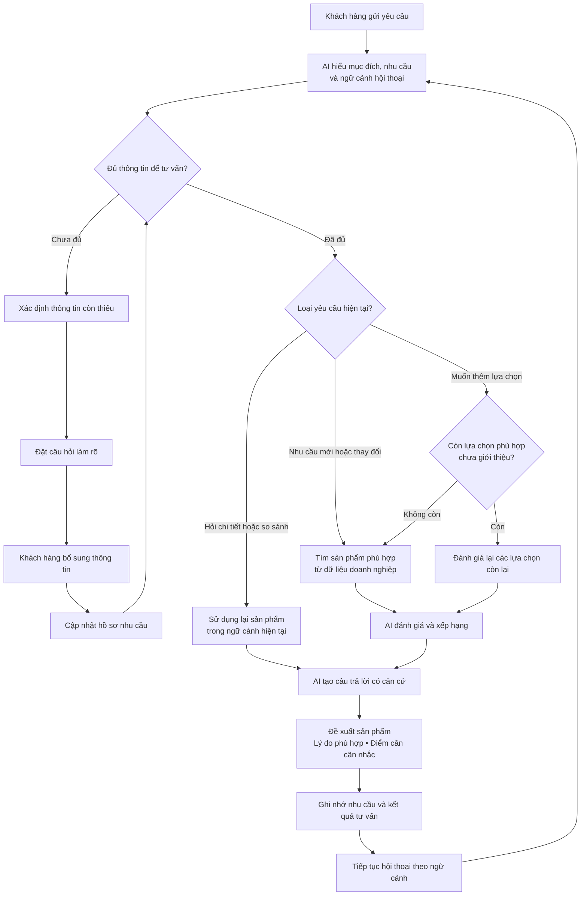

# Luồng xử lý AI-native

AI chỉ tạo đề xuất dựa trên dữ liệu sản phẩm của doanh nghiệp. Khi thông tin chưa đủ, AI chủ động làm rõ trước khi tư vấn; khi khách hàng hỏi tiếp, AI tận dụng ngữ cảnh đã có thay vì bắt đầu lại.
